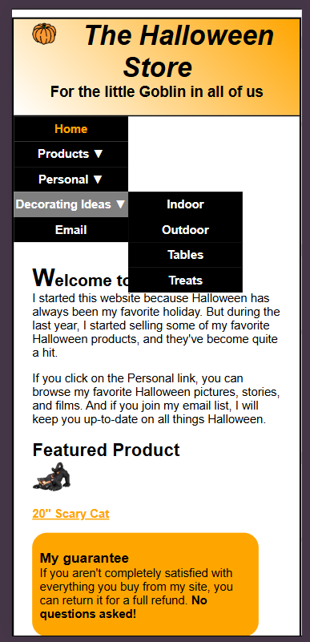
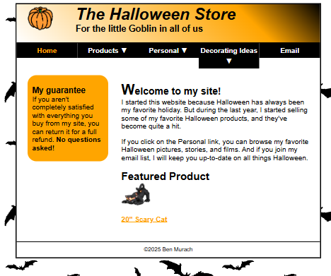
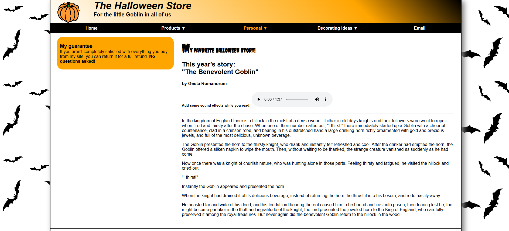
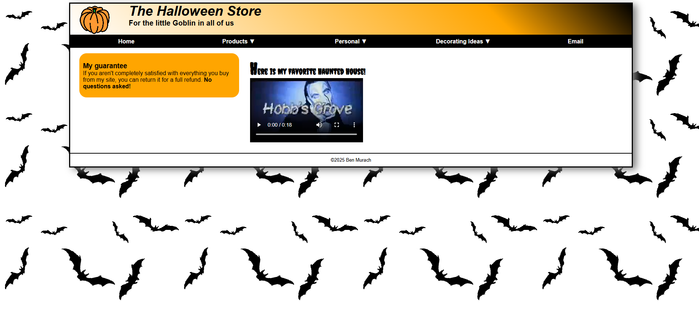

## 🎃 SENG 365 Halloween Store Website

This project is an ongoing Halloween store website developed throughout a series of labs for SENG 365, a client-side web development course at UNCW. 

📌**Note:** This project is still in progress. Updates will be made as labs are completed. 

## 🛠️ Technologies:

- **HTML** for structuring the web pages
- **CSS** for styling layouts, colors, and responsiveness
- **Javascript** for making the pages interactive
- **Visual Studio Code** as the development environment
- **GitHub** for version control

## 📝 Labs:
Each lab introduces new concepts and features, building towards a fully functional website.

  
Click to view lab details

   

- **Lab 1:** Create the [Home Page](#home-page) (HTML structure)
- **Lab 2:** Apply external CSS to format the [Home Page](#home-page)
- **Lab 3:** Add spacing, borders, and background using the CSS box model
- **Lab 4:** Implement Flexbox for a 2-column layout & horizontal navigation bar
- **Lab 5:** Add dropdown navigation (2nd-tier menu)
- **Lab 6:** Create the [Props Page](#props-page) with product listings and links
- **Lab 7:** Create the [Costumes Page](#costumes-page) with images, product descriptions, and links
- **Lab 8:** Create the [Personal Page](#personal-page) and [Videos Page](#videos-page) with imported fonts, audio, video, and a print style sheet
- **Lab 9:** Enhance the [Home Page](#home-page) to make it responsive

## 📁 How to Run the Project:

To view the Halloween Store website locally:

1. Clone this repository
2. Open the project folder in VS Code
3. Install the **Live Server** extension in VS Code
4. Naviagate to `index.html`
5. Select the **Go Live** option at the bottom right of the VS Code window
5. The website will automatically open in your browser

## 📸 Current Screenshots:

### Home Page:

  
Click to view responsive home page screenshots

 

  

    
<strong>iPhone 12 Pro Example:</strong>

    
  

  

    
<strong>iPad Mini Example:</strong>

    
  

### Props Page:

### Costumes Page:

### Personal Page:

### Videos Page:
